本章以程序 ```hello.c``` 为例，简述程序是如何被运行的

## 一、编译过程

> 程序翻译有 **四个** 步骤：预处理器、编译器、汇编器、链接器  
> 
> 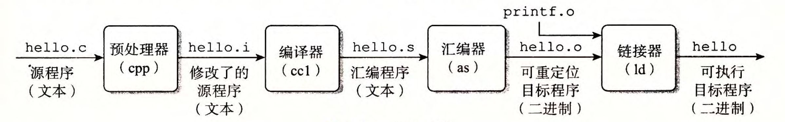
>
> 这四个部分一起构成了 **编译系统**  
> 
### 1. 预处理阶段：
**预处理器 (cpp)** 根据预处理指令 (#开头) 修改原始的 C 程序。  
比如对于 ```#include <stdio.h>``` ，预处理器会读取系统头文件 ```stdio.h``` 的内容，并把它直接插入到程序文本中。  
此时文件从```hello.c -> hello.i```  

### 2. 编译阶段：
**编译器 (ccl)** 将 ```hello.i``` 翻译成 ```hello.s```，它包含一个 **汇编语言程序**。它包含函数 ```main``` 的定义  
```
main: 
  subq  $8, %rsp
  movl  $.LCO, %edi  
  call  puts  
  movl  $0, $eax
  addq  $8, %rsp
  ret
```
以上就是汇编语言，它为不同高级语言的不同编译器提供了通用的输出语言  

### 3. 汇编阶段：  
**汇编器 (as)** 将 ```hello.s``` 翻译成机器语言，并将这些指令打包成一种叫做 **可重定位目标程序(relocatable object program)** 的格式，并将 ```hello.s``` 文件翻译成 ```hello.o``` (二进制文本) 

### 4. 链接阶段：
**链接器 (ld)** 负责将函数文件 (例如 ```printf.o``` 文件) 和 ```hello.o``` 文件合并，成为 **可执行文件** ```hello```

---


## 1.4 Processors Read and Interpret Instructions Stored in Memory

### 1.4.1 Hardware Organization of a System

系统的硬件组成：  
---
1. 总线
2. $I/O$ 设备 ( in / out )
3. 主存
4. 处理器

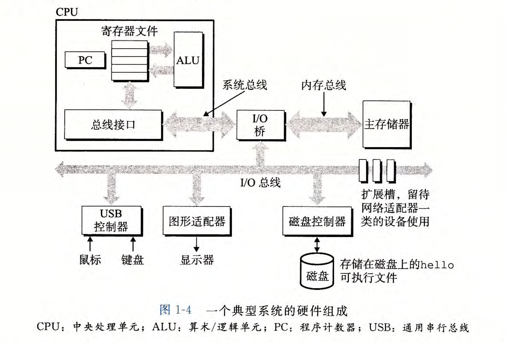
具体：
---
- **总线** 用于 **传送定长的字节块**，每次传输的大小即一个 **字** 的大小。  
32位机器总线宽度为32位，64位机器总线宽度为64位。
  
- 每个 $I/O$ 设备都通过一个 **控制器** 或 **适配器** 与 $I/O$ 总线相连。  
控制器和适配器的区别主要在于 **封装方式**。  
控制器是主板上的 **芯片组** ，适配器是一块 **插在主板上的卡**。  
**控制器** 和 **适配器** 的功能都是在 $I/O$ 总线和 $I/O$ 设备之间传递信息。
- **主存** 是一个临时存储设备。  
物理上：由一组**动态随机存取存储器** $(DRAM)$ 芯片组成。  
逻辑上：是一个 **线性的字节数组**，每个字节都有唯一的地址。
- 中央处理单元 $(CPU)$，简称 **处理器**。  
是解释（执行）主存中指令的引擎。  
处理器的核心是一个大小为 **一个字** 的 **存储设备** （或寄存器），成为 **程序计数器** $(PC)$。  
在任何时候，程序计数器都指向主存中的某条机器指令
运行：
---
围绕：**主存**，**寄存器文件 (register file)** 和 **算术/逻辑单元 (ALU)** 进行。  
- 加载：从 **主存 复制** 一个字节或一个字到 **寄存器**。覆盖原来的内容。  
- 存储：从 **寄存器 复制** 一个字节或一个字到 **主存**。覆盖原来的内容。  
- 操作：把 **两个寄存器** 的内容复制到 $ALU$， $ALU$ 对这两个字做 **算术运算**，并将结果存放到一个寄存器中，覆盖原来的结果。
- 跳转：从指令本身抽取一个 **字**，并将这个字复制到 **程序计数器**，覆盖程序计数器中原来的值。

### 1.4.2 Running the hello Program

复制到主存
---
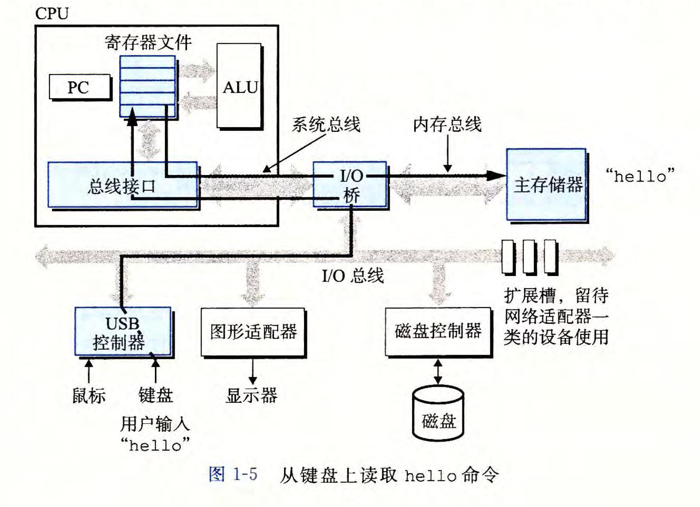

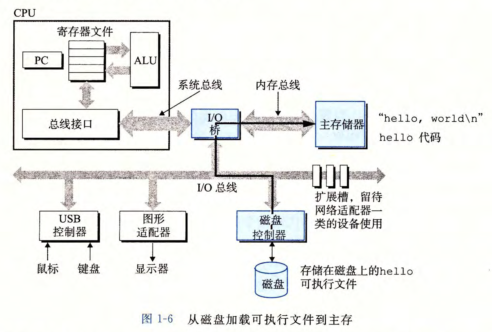

显示输出
---
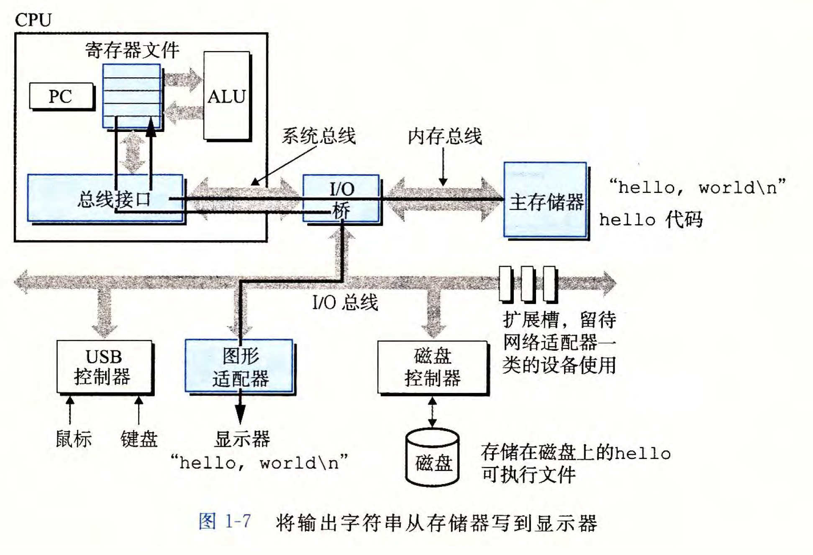

## 1.5 Caches Matter
高速缓存至关重要
--
> **问题：系统花费大量的时间进行信息移动。**  
> **解决：高速缓存存储器 (cache memory)**
> 
>   

## 1.6 Storage Devices Form a Hierarchy

存储设备形成层次结构
---
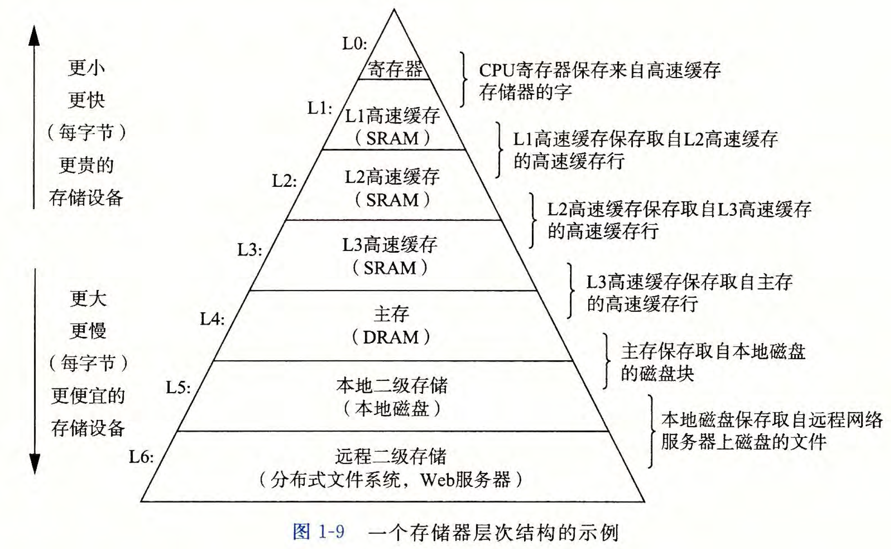

## 1.7 The Operating System Manages the Hardware

> 所有应用程序对硬件的操作尝试都必须 **通过操作系统**  
> 
> 操作系统有两个基本功能：  
> - 防止硬件被失控的应用程序滥用
> - 向应用程序 **提供简单一致的机制** 来控制复杂而又通常大不相同的低级硬件设备。
> 
>  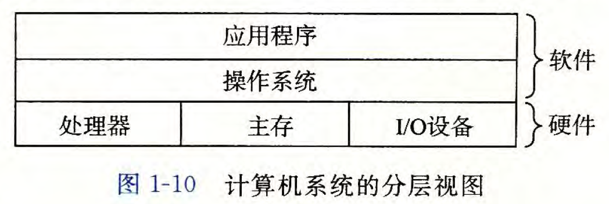
>
> 操作系统通过几个抽象概念（**进程，虚拟内存，文件**）来实现这两个功能
>
> - 进程是对处理器，主存，$I/O$ 设备的抽象表示
> - 虚拟内存是对主存，磁盘 $I/O$ 设备的抽象表示
> - 文件是对 $I/O$ 设备的抽象表示
> 
> 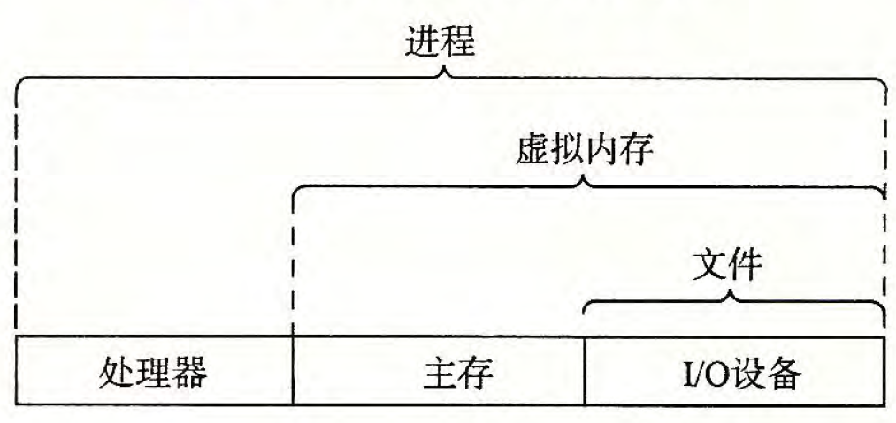
>
### 1.7.1 Processes（进程）
> **进程** 是操作系统对一个正在运行的程序的一种抽象。  
> - 在一个系统上可以同时运行 **多个进程**，而每个进程都 **好像** 在独占地使用硬件。  
> - **并发运行**，是说一个进程的指令和另一个进程的指令是交错执行的。
> - 无论是在单核还是多核系统中，一个CPU 看上去都像是在并发地执行多个进程，这是通过处理器 **在进程间切换** 来实现的。
> - 操作系统实现这种交错执行的机制称为 **上下文切换**。
> 
> 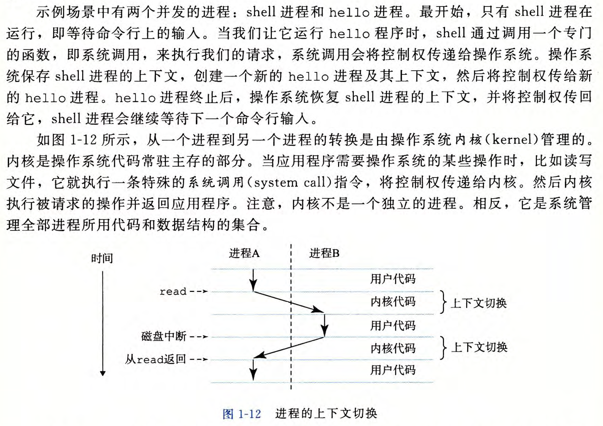
>
### 1.7.2 Threads（线程）
> 一个进程实际上可以由多个成为线程的执行单元组成。  
> 多线程之间比多进程之间更容易 **共享数据**，线程一般来说都比进程更 **高效**。
>
### 1.7.3 Virtual Memory（虚拟内存）
> 虚拟内存是一个抽象概念，它为每个进程提供了一个假象，即 **每个进程都在独占地使用主存。**  
> 


### 1.7.4 Files（文件）

> 文件就是 **字节序列**  
> 每个 $I/O$ 设备，包括磁盘、键盘、显示器，甚至网络，都可以看成是文件  
> 文件为应用程序提供了一个 **统一的视图**，同一个程序可以在使用 **不同** 磁盘技术的 **不同** 系统上运行。

## 1.8 Systems Communicate with Other Systems Using Networks

系统之间利用网络通信
--
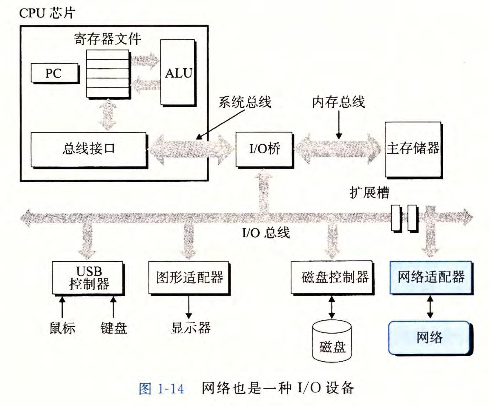
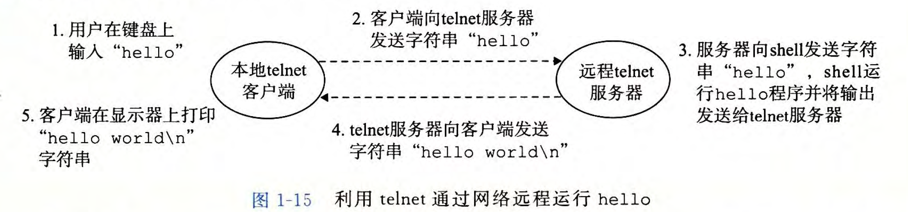

## 1.9 Important Themes

balabala